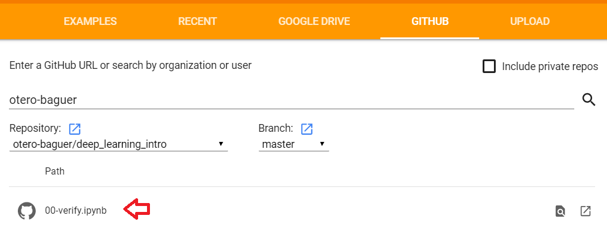

# Exercises for the ROMSOC Deep Learning training course

Here you will find the course exercises as well as the solutions.
If you have any question or find any error please write me an email to otero@uni-bremen.de.

## Google Colab instructions

1) Create a google account if you don't have one

2) Go to https://colab.research.google.com

3) Select the GITHUB tab and type `otero-baguer`. Then select the `deep_learning_intro` repository (master branch).

4) There you will see the notebooks we are going to use for the exercises. Initially try the `00-verify` notebook to check that everything works properly.

## Local installation instructions

### 1) Create folder for the exercises 
If you are using Git, then this happens automatically, otherwise download a .zip file with the content of the repository and uncompress it. Be careful that you don't loose your own solutions when updating the folder!

### 2) Install Python

For the exercises we are going to use Python (Miniconda distribution).

The installer files for all platforms (Windows, Lunix, Mac) can be found in:

[https://docs.conda.io/en/latest/miniconda.html](https://docs.conda.io/en/latest/miniconda.html)

Please download the appropiate installer and run it.

 - If your computer has a 64-bit operating system (most likely) select the *64-bit installer* for *Python 3.7*.

 - If your system has a 32-bit operating system (unlikely) you will need to install the *32-bit installer* for *Python 3.7*.
 
 - If you get asked if you want to add the Miniconda directory to the `PATH` select yes.
 
 
Confirm that you have successfully installed Miniconda by opening a console and typing `conda`. If an error appears then Conda was not added to the `PATH`. You have to search for the *Anaconda Promt* terminal and open it. Then you have to change the directory the terminal is pointing to, using for example `cd local_folder\local_folder2`, to the directory that contains the exercises.
 
### 3) Install required packages

The list of required packages is contained in the file [requirements.txt](/requirements.txt). To install all of them open a console on the folder where you have the file and type `pip install -r requirements.txt`.

### 4) Run Jupyter Notebook
When everything is installed open a terminal on the exercises folder and run `jupyter notebook`.

## Documentation

Whenever you are programming in any language it is really important to use the documentation to find out what methods are available on each package. 

These are some of the package documentations that might be helpful for you in this course:
 - [**numpy**](http://www.numpy.org/): for scientific computing (vectors and matrices operations)
 - [**sklearn**](https://scikit-learn.org): for machine learning tasks, includes example datasets and many usefull functions for doing machine learning.

## Exercise notebooks

- Notebook 1
- Notebook 2
- Notebook 3

Play online with Neural Networks for binary classification at [http://playground.tensorflow.org](http://playground.tensorflow.org)
